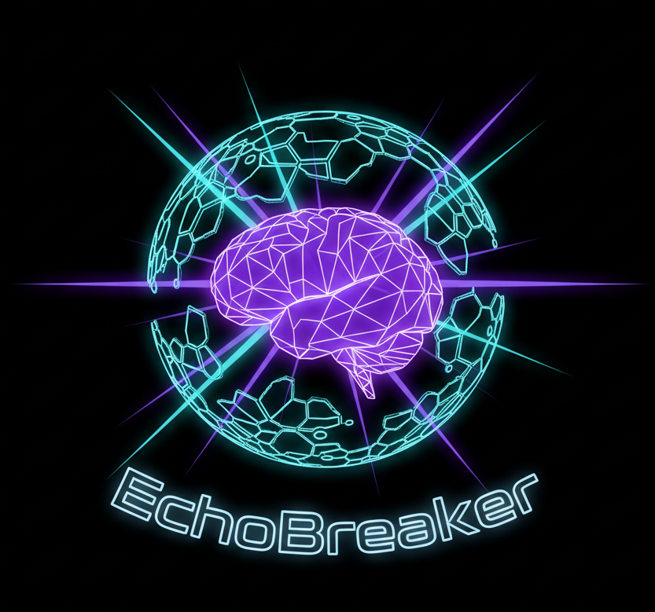

<div align="center">



# EchoBreaker

### *"The algorithm shows you what you want to see. We show you what you need to consider."*

[](https://www.python.org/)
[](https://fastapi.tiangolo.com/)
[](https://azure.microsoft.com/en-us/products/ai-services/openai-service)
[](https://groq.com/)
[](https://artificialintelligenceact.eu/)
[](LICENSE)

**Responsible AI · Counter-Perspective Engine · Filter Bubble Detection**

[Live Demo](#) · [Responsible AI Framework](RESPONSIBLE_AI.md) · [Report an Issue](https://github.com/AtamerErkal/EchoBreaker/issues)

</div>

---

## 🔴 Problem

Recommendation algorithms are not neutral. They are optimized for **engagement** — and engagement means showing you more of what you already believe.

Every time you watch a video, the algorithm learns your preferences and narrows your next recommendations. Over weeks and months, this creates an **algorithmic echo chamber**: a self-reinforcing loop where only one perspective is amplified, opposing viewpoints disappear, and your information diet quietly becomes a monologue.

This is not malicious. It's a structural consequence of engagement-optimized systems — and it happens invisibly.

**The result:**
- 🧠 Confirmation bias becomes the default mode of information consumption
- 📉 Exposure to opposing arguments drops to near zero
- 🌍 Society fragments into parallel information universes that rarely intersect

---

## 🟢 Solution

EchoBreaker is a **Responsible AI tool** that intercepts this loop.

Paste a YouTube URL — or search any topic directly. In **~5 seconds**, EchoBreaker extracts the video's captions (no audio download, no transcription delay), sends them to an LLM, and generates three structured counter-perspectives:

| Dimension | What it challenges |
|---|---|
| 🟣 **Ethical** | The moral assumptions and value trade-offs behind the argument |
| 🔵 **Empirical** | The data, research, and evidence the video doesn't show you |
| 🟡 **Logical** | The reasoning gaps, causal fallacies, or structural blind spots |

Alongside the counter-arguments, EchoBreaker shows you a **side-by-side comparison**: what the algorithm *would have recommended next* vs. what genuine intellectual diversity looks like.

> **We don't tell you what to think. We show you what else to think about.**

---

## 🟣 Impact

Users gain immediate exposure to the **strongest opposing arguments** they would never have encountered organically.

The effect is not correction — it is expansion. A user who watches a video on economic nationalism doesn't need to be told they're wrong. They need to encounter the most compelling case for open markets, articulated at its best. EchoBreaker delivers exactly that.

- **For individuals:** Break out of your filter bubble without abandoning your views
- **For students & educators:** Build critical thinking and media literacy through structured multi-perspective analysis
- **For researchers & journalists:** Surface authoritative counter-sources in seconds, not hours
- **For society:** Reduce polarization by creating friction against epistemic closure — one video at a time

---

## ⚡ How It Works

```
User Input (URL or Topic Search)
         │
         ▼
  YouTube Caption Extraction          ← yt-dlp, no audio download (~1s)
         │
         ▼
  LLM Analysis (Azure OpenAI / Groq)  ← Structured JSON prompt (~3-4s)
         │
         ├─ topic & primary_claim
         ├─ echo_chamber_query        ← What the algorithm would show next
         ├─ echo_chamber_description
         └─ counter_arguments [×3]
              ├─ Ethical
              ├─ Empirical
              └─ Logical

         ▼
  Results rendered in browser         ← Total: ~5 seconds
```

### Dual-Provider Architecture

Switch between providers with a single environment variable:

```env
PROVIDER=azure   # Azure OpenAI (GPT-5.4 Mini) — production
PROVIDER=groq    # Groq free tier (Llama 3.3 70B) — zero cost
```

No code changes. No redeploys. Both providers return identical output schemas.

---

## 🏗️ Project Structure

```
EchoBreaker/
├── api/
│   └── main.py                    # FastAPI — endpoints & static serving
├── core/
│   └── config.py                  # Provider selection & env config
├── services/
│   ├── reasoning/
│   │   └── generator.py           # AzureReasoningEngine | GroqReasoningEngine
│   ├── search/
│   │   └── youtube_search.py      # Lazy YouTube search (on-demand)
│   └── youtube/
│       └── downloader.py          # Caption extraction via yt-dlp
├── models/
│   └── analysis_result.py         # Pydantic v2 schemas
├── frontend/
│   └── index_v3.html              # Full-screen hero UI (Tailwind CSS)
├── images/
│   └── echobreaker_logo.png
├── .env.template
├── RESPONSIBLE_AI.md
└── requirements.txt
```

---

## 🚀 Quick Start

### 1. Clone & Install

```bash
git clone https://github.com/AtamerErkal/EchoBreaker.git
cd EchoBreaker

python -m venv venv
venv\Scripts\activate        # Windows
# source venv/bin/activate   # macOS/Linux

pip install -r requirements.txt
```

### 2. Configure Environment

```bash
cp .env.template .env
```

**Option A — Azure OpenAI:**
```env
PROVIDER=azure
AZURE_OPENAI_API_KEY=your-key
AZURE_OPENAI_ENDPOINT=https://your-resource.openai.azure.com/
AZURE_OPENAI_DEPLOYMENT=gpt-54-mini
AZURE_OPENAI_API_VERSION=2024-12-01-preview
```

**Option B — Groq (Free Tier):**
```env
PROVIDER=groq
GROQ_API_KEY=gsk_...           # Free key at console.groq.com
GROQ_MODEL=llama-3.3-70b-versatile
```

### 3. Run

```bash
uvicorn api.main:app --reload
```

Open [http://localhost:8000](http://localhost:8000) — paste any YouTube URL or search a topic.

---

## 🔌 API Reference

| Endpoint | Method | Description |
|---|---|---|
| `/` | `GET` | Serves the frontend |
| `/api/analyze` | `POST` | Analyzes a YouTube video URL |
| `/api/search-sources` | `POST` | Searches YouTube by query (lazy, on-demand) |
| `/api/health` | `GET` | Returns status and active provider |

**Example request:**
```bash
curl -X POST http://localhost:8000/api/analyze \
  -H "Content-Type: application/json" \
  -d '{"video_url": "https://www.youtube.com/watch?v=..."}'
```

**Example response:**
```json
{
  "topic": "Universal Basic Income",
  "primary_claim": "UBI would eliminate poverty without reducing work incentives.",
  "echo_chamber_query": "UBI success stories basic income works",
  "echo_chamber_description": "The algorithm would keep showing you positive UBI pilots, ignoring fiscal concerns.",
  "counter_arguments": [
    {
      "type": "Ethical",
      "title": "Unconditional Income Undermines Social Contribution",
      "key_point": "...",
      "why_it_matters": "...",
      "academic_ref": "Mead, L. — The New Politics of Poverty (1992)",
      "youtube_search_url": "https://youtube.com/results?search_query=...",
      "scholar_search_url": "https://scholar.google.com/scholar?q=..."
    }
  ]
}
```

---

## ⚖️ Responsible AI

EchoBreaker is designed from the ground up with Responsible AI principles — not as an afterthought.

| Principle | Implementation |
|---|---|
| **Transparency** | Open-source, no hidden algorithmic decisions, full prompt visible in code |
| **Privacy** | Zero data stored, no cookies, no user tracking, captions discarded after analysis |
| **Fairness** | Three-dimensional analysis prevents any single ideological bias from dominating |
| **Human Agency** | Counter-perspectives are invitations, not prescriptions — users decide |
| **EU AI Act** | Aligned with transparency and human oversight requirements |
| **Accountability** | In-app feedback mechanism; users can flag inaccuracies or harmful content |

→ Read the full framework: [RESPONSIBLE_AI.md](RESPONSIBLE_AI.md)

---

## 🛣️ Roadmap

- [x] Caption-based pipeline (~5s, no audio download)
- [x] Dual LLM provider (Azure OpenAI + Groq)
- [x] Topic search mode (no URL required)
- [x] Echo chamber comparison view
- [x] Responsible AI feedback mechanism
- [ ] Browser extension (analyze while watching)
- [ ] Multi-language caption support (DE, TR, FR)
- [ ] Batch analysis (full playlists)
- [ ] Shareable analysis links

---

## 🤝 Contributing

Contributions that advance the mission of reducing polarization through technology are welcome.

```bash
# Fork, clone, and create a branch
git checkout -b feature/your-feature

# Make changes, then submit a PR
```

**Priority areas:** prompt quality, new LLM providers, UI/UX improvements, multilingual support.

---

## 📄 License

MIT License — see [LICENSE](LICENSE) for details.

---

<div align="center">

**Break echo chambers. Reduce polarization. Enable informed citizenship.**

*"The test of a first-rate intelligence is the ability to hold two opposed ideas in mind at the same time and still retain the ability to function."*
— F. Scott Fitzgerald

---

[](https://github.com/AtamerErkal/EchoBreaker)

[⭐ Star this repo](https://github.com/AtamerErkal/EchoBreaker) · [🐛 Report Bug](https://github.com/AtamerErkal/EchoBreaker/issues) · [💡 Request Feature](https://github.com/AtamerErkal/EchoBreaker/issues)

</div>
